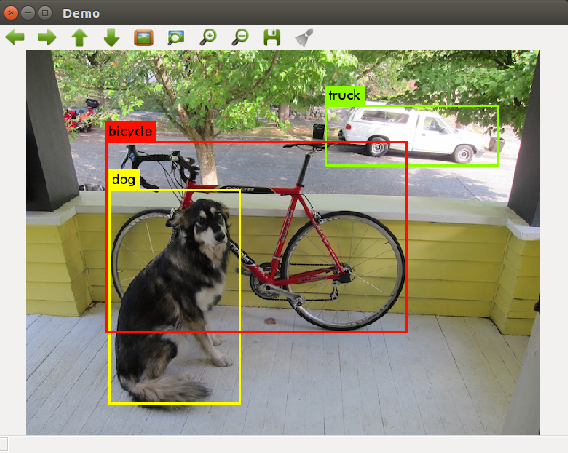
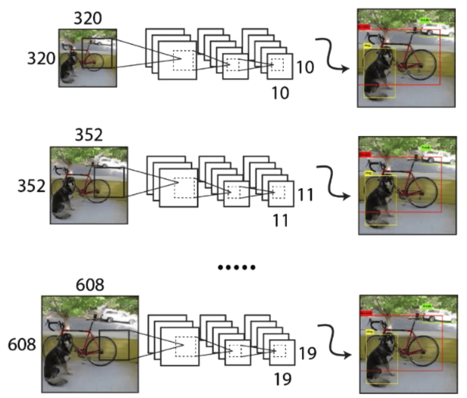

# YOLOv3 Real-Time Object Detection

This project uses the YOLOv3 model to recognize objects in real time via a video stream from a camera. The model frames objects and displays labels with classes on the screen.


## Project structure

main.py : the main script for capturing video from the camera and detecting objects.
yolov3.weights: the weights file for YOLOv3.
yolov3.cfg: YOLOv3 configuration file.
coco.names: A list of class names recognized by the model.

## Installation

Before starting the project, make sure that the necessary libraries are installed:
``bash
pip install opencv-python
pip install numpy
``
### Linux and macOS

On Linux and macOS, wget is often installed by default. To download the YOLOv3 file, simply use the command:
``bash
wget https://pjreddie.com/media/files/yolov3.weights -P path/to/save
```

Replace path/to/save with the desired path where you want to save the file.

### Windows

On Windows, you can install wget using Windows Package Manager (for example, Chocolatey) or via Windows Subsystem for Linux (WSL).

Installing wget using Chocolatey:

Install Chocolatey first, if you don't have it installed yet.
At the command prompt, run:
``bash
choco install wget
```

After installation, use the same wget command as on Linux or macOS:
``bash
wget https://pjreddie.com/media/files/yolov3.weights -P path\to\save
```

## Launch

Clone the repository:
``bash
git clone https://github.com/NexaSag3/object_detection
cd object_detection
```
Run the script:
``bash
python main.py
``
To exit the program, press q.
## Description

The script processes camera frames using YOLOv3 to recognize objects in real time. Boxes and labels with the names of the classes recognized by the model are superimposed on each frame.

## Example Of Output
Multi-Level Object Detection

The image above shows an example of how YOLOv3 processes an image at different scales (320x320, 352x352, 608x608) to detect objects of various sizes. This feature allows the model to accurately recognize both large and small objects in a single frame, improving overall detection accuracy.

Detection Output Data

This image shows the result of YOLOv3's work on object recognition. The model identifies several objects in the frame and frames them. Each frame contains a label with the name of the object's class and the confidence level of the model. In this example, YOLOv3 detects a dog, bike, and truck by highlighting each object with a separate frame and label.

## Settings

Probability threshold: Defines the minimum confidence level (0.5 by default) for object allocation.
```shell
# Checking the probability threshold
            if confidence > 0.6: # For example, the probability threshold can be changed to 0.6
# Converting the coordinates of the center and the size of the object to the coordinates of the box
                center_x = int(detection[0] * width)
                center_y = int(detection[1] * height)
                w = int(detection[2] * width)
                h = int(detection[3] * height)
```

NMS (Non-Maximum Suppression): used to remove overlapping boxes, the NMS threshold is set to 0.4.
``shell
indexes = cv2.dnn.NMSBoxes(boxes, confidences, 0.6, 0.3) # For example, you can change the confidence threshold to 0.6 and the NMS threshold to 0.3
``
These settings can be adjusted to improve speech recognition performance, depending on your needs.

## Support

If you like this project or it turned out to be useful, please put ⭐️ to support its development!


## In Russian  /  На русском языке


# YOLOv3 Real-Time Object Detection

Этот проект использует модель YOLOv3 для распознавания объектов в реальном времени через видеопоток с камеры. Модель выделяет объекты рамками и выводит метки с классами на экран.


## Структура проекта

main.py: основной скрипт для захвата видео с камеры и детекции объектов.
yolov3.weights: файл весов для YOLOv3.
yolov3.cfg: файл конфигурации YOLOv3.
coco.names: список имен классов, распознаваемых моделью.

## Установка

Перед запуском проекта убедитесь, что установлены необходимые библиотеки:
```bash
pip install opencv-python
pip install numpy
```
### Linux и macOS

На Linux и macOS wget часто установлен по умолчанию. Чтобы загрузить файл YOLOv3, просто используйте команду:
```bash
wget https://pjreddie.com/media/files/yolov3.weights -P path/to/save
```

Замените path/to/save на нужный путь, куда хотите сохранить файл.

### Windows

На Windows вы можете установить wget с помощью Windows Package Manager (например, Chocolatey) или через Windows Subsystem for Linux (WSL).

Установка wget с помощью Chocolatey:

Сначала установите Chocolatey, если он у вас ещё не установлен.
В командной строке запустите:
```bash
choco install wget
```

После установки используйте ту же команду wget, что и на Linux или macOS:
```bash
wget https://pjreddie.com/media/files/yolov3.weights -P path\to\save
```

## Запуск

Клонируйте репозиторий:
```bash
git clone https://github.com/NexaSag3/object_detection
cd object_detection
```
Запустите скрипт:
```bash
python main.py
```
Для выхода из программы нажмите q.
## Описание

Скрипт обрабатывает кадры с камеры, используя YOLOv3, чтобы распознавать объекты в реальном времени. На каждый кадр накладываются боксы и метки с именами классов, распознанных моделью.

## Пример Выходных Данных
Многоуровневая Детекция Объектов

На изображении выше показан пример того, как YOLOv3 обрабатывает изображение на разных масштабах (320x320, 352x352, 608x608) для обнаружения объектов различных размеров. Эта функция позволяет модели точно распознавать как крупные, так и мелкие объекты в одном кадре, улучшая общую точность детекции.

Выходные Данные Детекции

На этом изображении показан результат работы YOLOv3 по распознаванию объектов. Модель идентифицирует несколько объектов на кадре и обводит их рамками. Каждая рамка содержит метку с названием класса объекта и уровень уверенности модели. В этом примере YOLOv3 обнаруживает собаку, велосипед и грузовик, выделяя каждый объект отдельной рамкой и меткой.

## Настройки

Порог вероятности: определяет минимальный уровень доверия (по умолчанию 0.5) для выделения объекта.
```shell
# Проверка порога вероятности
            if confidence > 0.6: # К примеру порог вероятности можно поменять до 0.6
                # Преобразование координат центра и размеров объекта в координаты бокса
                center_x = int(detection[0] * width)
                center_y = int(detection[1] * height)
                w = int(detection[2] * width)
                h = int(detection[3] * height)
```

NMS (Non-Maximum Suppression): используется для удаления перекрывающихся боксов, порог NMS установлен на 0.4.
```shell
indexes = cv2.dnn.NMSBoxes(boxes, confidences, 0.6, 0.3)  # К Примеру можно поменять порог уверенности на 0.6 и порог NMS на 0.3
```
Эти настройки можно регулировать для повышения производительности распознавания в зависимости от ваших потребностей.

## Поддержка

Если вам нравится этот проект или он оказался полезен, пожалуйста, поставьте ⭐️, чтобы поддержать его развитие!
