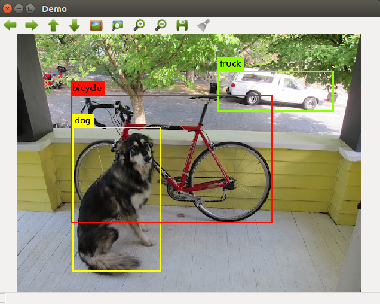
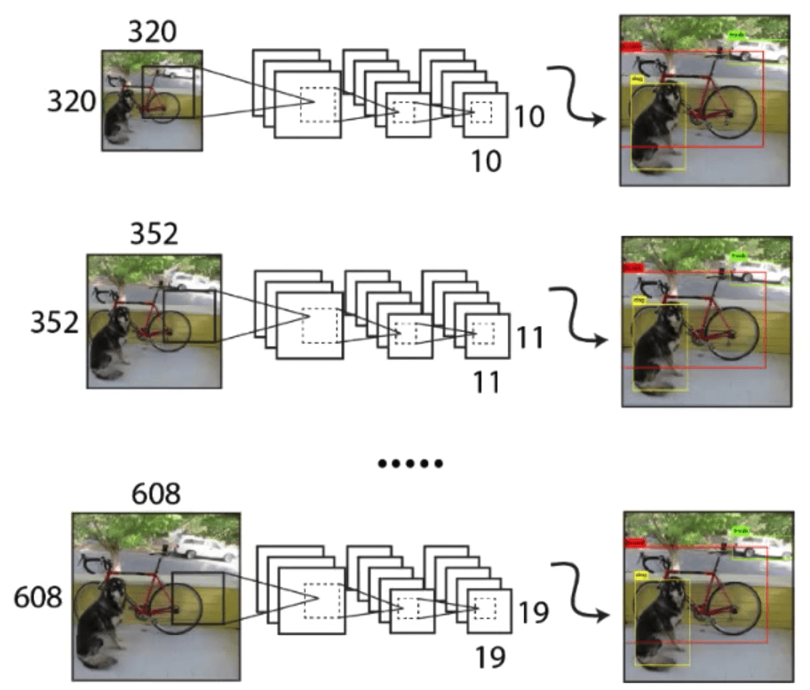

# YOLOv3 Real-Time Object Detection

Этот проект использует модель YOLOv3 для распознавания объектов в реальном времени через видеопоток с камеры. Модель выделяет объекты рамками и выводит метки с классами на экран.


## Структура проекта

main.py: основной скрипт для захвата видео с камеры и детекции объектов.
yolov3.weights: файл весов для YOLOv3.
yolov3.cfg: файл конфигурации YOLOv3.
coco.names: список имен классов, распознаваемых моделью.

## Установка

Перед запуском проекта убедитесь, что установлены необходимые библиотеки:
```bash
pip install opencv-python
pip install numpy
```
### Linux и macOS

На Linux и macOS wget часто установлен по умолчанию. Чтобы загрузить файл YOLOv3, просто используйте команду:
```bash
wget https://pjreddie.com/media/files/yolov3.weights -P path/to/save
```

Замените path/to/save на нужный путь, куда хотите сохранить файл.

### Windows

На Windows вы можете установить wget с помощью Windows Package Manager (например, Chocolatey) или через Windows Subsystem for Linux (WSL).

Установка wget с помощью Chocolatey:

Сначала установите Chocolatey, если он у вас ещё не установлен.
В командной строке запустите:
```bash
choco install wget
```

После установки используйте ту же команду wget, что и на Linux или macOS:
```bash
wget https://pjreddie.com/media/files/yolov3.weights -P path\to\save
```

## Запуск

Клонируйте репозиторий:
```bash
git clone https://github.com/NexaSag3/object_detection
cd object_detection
```
Запустите скрипт:
```bash
python main.py
```
Для выхода из программы нажмите q.
## Описание

Скрипт обрабатывает кадры с камеры, используя YOLOv3, чтобы распознавать объекты в реальном времени. На каждый кадр накладываются боксы и метки с именами классов, распознанных моделью.

## Пример Выходных Данных
Многоуровневая Детекция Объектов

На изображении выше показан пример того, как YOLOv3 обрабатывает изображение на разных масштабах (320x320, 352x352, 608x608) для обнаружения объектов различных размеров. Эта функция позволяет модели точно распознавать как крупные, так и мелкие объекты в одном кадре, улучшая общую точность детекции.

Выходные Данные Детекции

На этом изображении показан результат работы YOLOv3 по распознаванию объектов. Модель идентифицирует несколько объектов на кадре и обводит их рамками. Каждая рамка содержит метку с названием класса объекта и уровень уверенности модели. В этом примере YOLOv3 обнаруживает собаку, велосипед и грузовик, выделяя каждый объект отдельной рамкой и меткой.

## Настройки

Порог вероятности: определяет минимальный уровень доверия (по умолчанию 0.5) для выделения объекта.
```shell
# Проверка порога вероятности
            if confidence > 0.6: # К примеру порог вероятности можно поменять до 0.6
                # Преобразование координат центра и размеров объекта в координаты бокса
                center_x = int(detection[0] * width)
                center_y = int(detection[1] * height)
                w = int(detection[2] * width)
                h = int(detection[3] * height)
```

NMS (Non-Maximum Suppression): используется для удаления перекрывающихся боксов, порог NMS установлен на 0.4.
```shell
indexes = cv2.dnn.NMSBoxes(boxes, confidences, 0.6, 0.3)  # К Примеру можно поменять порог уверенности на 0.6 и порог NMS на 0.3
```
Эти настройки можно регулировать для повышения производительности распознавания в зависимости от ваших потребностей.

## Поддержка

Если вам нравится этот проект или он оказался полезен, пожалуйста, поставьте ⭐️, чтобы поддержать его развитие!
